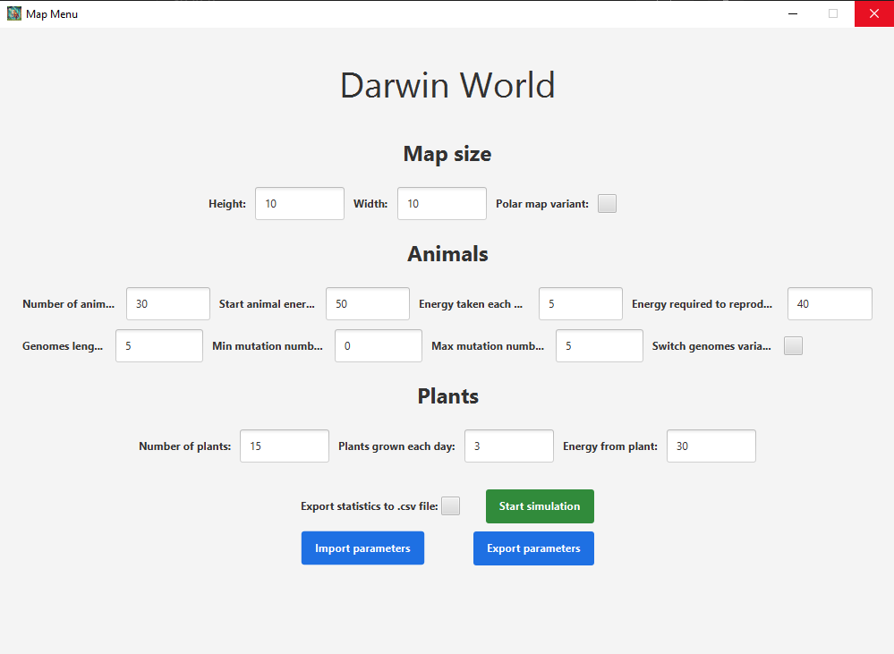

# 🌱 Darwin World - Variant A2

**Authors**: Iwo Zowada [IwoZ](https://github.com/Iwo-Z) i Marcin Szulc [mmMarcinus](https://github.com/mmMarcinus)

**Task variant**: A2  

Darwin World is a simulation of a world in which evolving animals traverse the map in search of food, reproduce, and their behavior changes over time depending on their genotype and selected environmental parameters.

---

## 🧠 Key functionalities

- Interactive simulation based on environmental and evolutionary parameters.
- Ability to run multiple simulations simultaneously.
- Dynamic GUI with visualization of the world, plants and animals.
- Support for multiple variants:
  - **Map**: globe, poles (variant A).
  - **Animal behavior**: full predestination, old age no joy (variant 4).
  - **Mutations**: full randomness.
  - **Plant growth**: forested equators.
- Real-time statistics:
  - number of animals and plants
  - number of free fields
  - most popular genotypes
  - average energy and life expectancy
  - average number of children

---

## 🧰 Technologies

- **Java 23**
- **JavaFX** - graphical interface
- **Gradle** - project management
- **FXML** - GUI structure

---

## 📸 Gallery




---

## 🚀 How to run

1. Clone the repository:
   ```bash
   git clone https://github.com/twoj-login/darwin-world.git
2. Run the file with the path 
